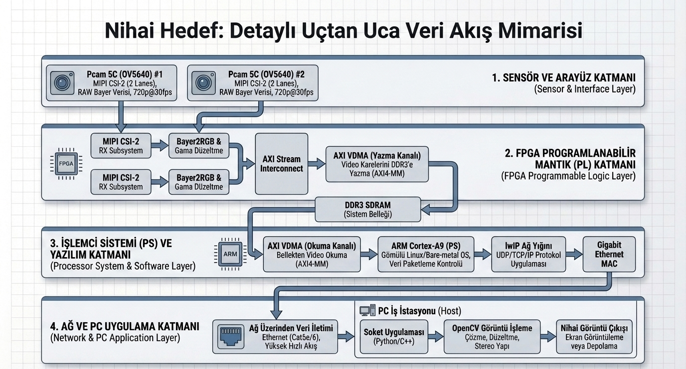
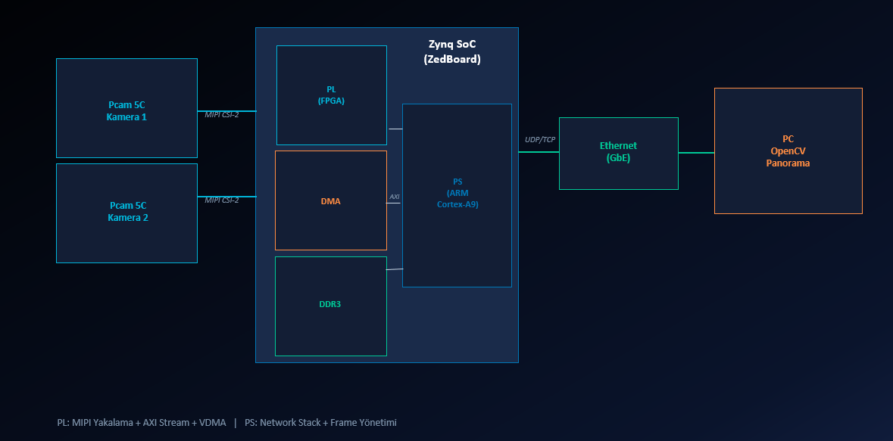
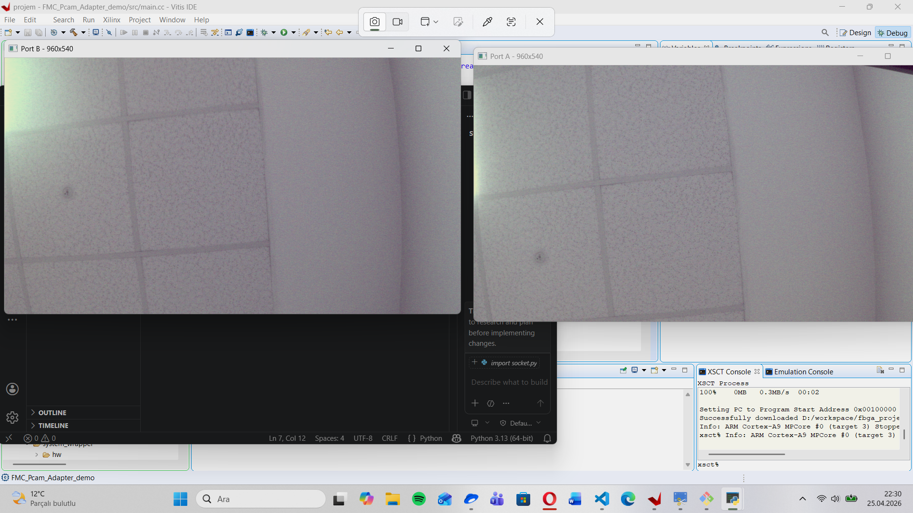
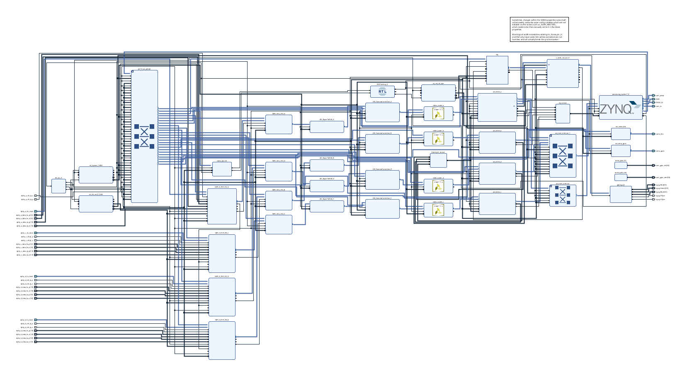
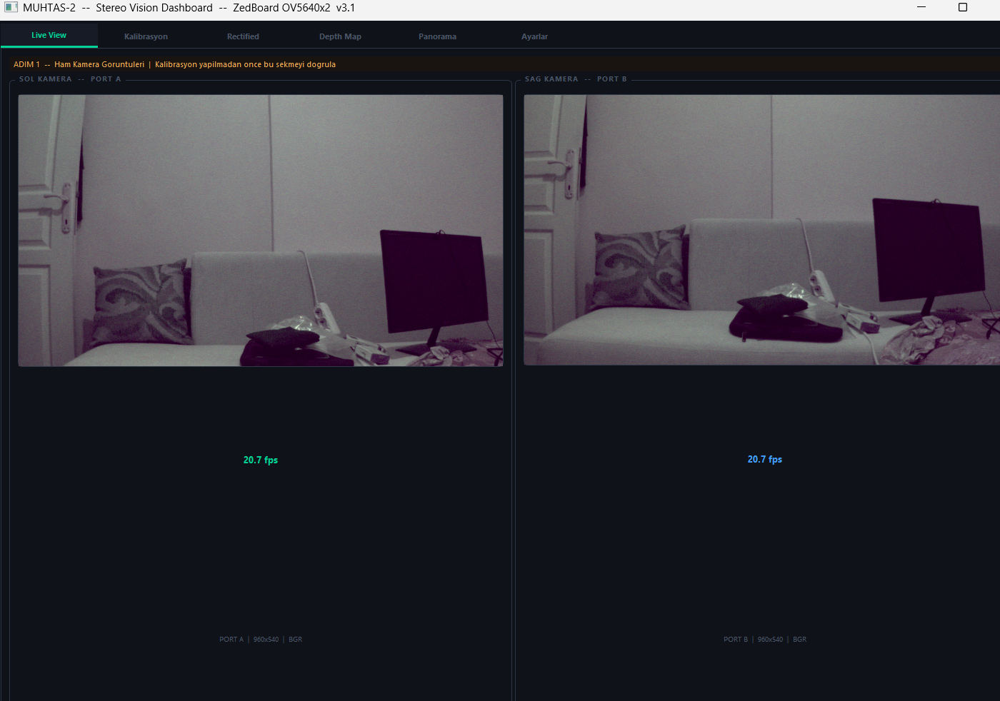
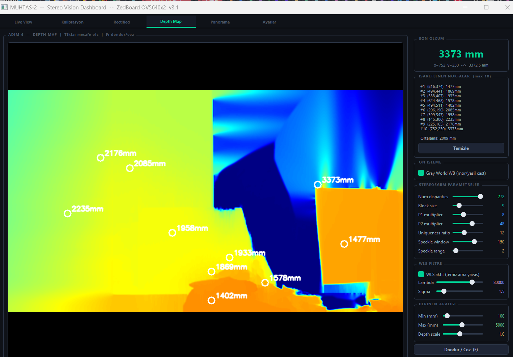

# FPGA Tabanlı Çift Kamera Destekli Gerçek Zamanlı Stereo Görüntü Aktarım Sistemi

<div align="center">

[](https://gitlab.com/senadurarslan/muhtas2-220208041/-/pipelines)


**MÜHTAS-2 | Kocaeli Üniversitesi Mühendislik Fakültesi**
Elektronik ve Haberleşme Mühendisliği — 2025-2026 Dönem Projesi
**Öğrenci:** Sena Sümeyye DURARSLAN (220208041) | **Danışman:** Doç. Dr. Anıl ÇELEBİ

</div>

---

## Ders ve Proje Oynatma Listeleri

### FPGA ve Gömülü Sistemler Laboratuvarı
[FPGA ve Gömülü Sistemler Lab Playlist](https://www.youtube.com/playlist?list=PLeLpqnbPLxx7-atBR0zlaCGycbTNQZUoE)

### MUHTAS Projesi
[MUHTAS Projesi Playlist](https://www.youtube.com/playlist?list=PLeLpqnbPLxx6lbPfqskw-W4pXyyLIWIze)

---

## Proje Özeti

Bu proje, **ZedBoard (Zynq-7020 SoC)** platformu üzerinde **iki adet OV5640 MIPI CSI-2 kamera** kullanarak gerçek zamanlı stereo görüntü yakalama, FPGA tabanlı donanım boru hattında işleme ve **Ethernet (UDP) üzerinden bilgisayara aktarım** sistemini gerçekleştirmektedir.

Sistem; MIPI D-PHY, AXI VDMA, lwIP ve OpenCV bileşenlerini bir araya getirerek **bare-metal donanım-yazılım birlikte tasarım (HW/SW Co-Design)** yaklaşımıyla geliştirilmiştir.

PC tarafında **PyQt5 tabanlı çok sekmeli GUI** uygulaması geliştirilmiş; stereo kalibrasyon, rectification, StereoSGBM tabanlı disparity hesaplama ve JET renk haritası ile derinlik haritası üretimi tamamlanmıştır.

---

## Proje Amacı

- İki farklı kameradan **eş zamanlı** görüntü verisi almak (Port A ve Port B)
- Görüntüleri FPGA donanım boru hattında işleyip DDR3 belleğe tamponlamak
- Gigabit Ethernet üzerinden **UDP protokolüyle** bilgisayara aktarmak
- PC tarafında **OpenCV** ile görüntüleri yeniden oluşturmak ve görüntülemek
- Stereo kamera çiftinden **derinlik haritası** üretmek
- **PyQt5 GUI** ile canlı görüntü, kalibrasyon ve derinlik haritasını tek arayüzde sunmak

---

## Sistem Mimarisi




### PL Boru Hattı Blokları

| Blok | Görevi |
|------|--------|
| MIPI D-PHY RX | Fiziksel katman veri alımı |
| MIPI CSI-2 RX | Çerçeve ayrıştırma |
| AXI Bayer-to-RGB | Ham sensör verisini RGB'ye dönüştürme |
| AXI Gamma Correction | Parlaklık düzeltmesi |
| HLS Video Scaler | Çözünürlük ölçekleme (1920×1080 → 960×540) |
| AXI VDMA | DMA ile DDR3'e çerçeve yazımı (Port A sol yarı, Port B sağ yarı) |
| AXI Interconnect | AXI bus yönetimi |
| AXI GPIO | Kamera reset, enable ve yönlendirme sinyal kontrolü |
| Clocking Wizard | Çoklu clock üretimi |
| Zynq7 PS | ARM Cortex-A9 — lwIP, UDP, VDMA yönetimi |

---

## Sistem Görselleri


### Çift Kamera Canlı Akışı


*Port A (960×540) ve Port B (960×540) — ~20.7 FPS UDP akışı*

### Vivado Blok Tasarımı



### GUI — Stereo Vision Dashboard


*PyQt5 tabanlı çok sekmeli arayüz — Live View sekmesi (~20.7 FPS)*

### Derinlik Haritası


*StereoSGBM + WLS filtresi — JET renk haritası, mm cinsinden mesafe ölçümü*

---

## Stereo Vision Pipeline

```
Sol Kamera (Port A)    Sağ Kamera (Port B)
       │                      │
       └──────┬───────────────┘
              ▼
     UDP Fragment Reassembly (1111 paket/frame)
              │
              ▼
     BGR Dönüştürme + Görüntü Doğrulama
              │
              ▼
     Lens Distorsiyon Düzeltme (Undistortion)
              │
              ▼
     Stereo Rektifikasyon (stereoRectify + remap)
              │
              ▼
     Disparity Haritası (StereoSGBM + WLS Filtresi)
              │
              ▼
     Derinlik Haritası  Z = f·B / d
              │
              ▼
     Mesafe Ölçümü (piksel tıklama → mm)
```

---

## Neden Bu Mimari?

| Karar | Gerekçe |
|-------|---------|
| **ZedBoard / Zynq-7020** | PS+PL tek yongada; görüntü işleme için donanım paralelliği + ARM esnekliği |
| **Bare-metal** | Linux'a göre düşük gecikme, doğrudan donanım erişimi, deterministik zamanlama |
| **MIPI CSI-2** | Modern kamera sensörlerinde standart, yüksek bant genişlikli arayüz |
| **AXI VDMA** | Yüksek hızlı DMA ile DDR3 frame buffering; CPU yükü minimize |
| **Gigabit Ethernet** | USB/UART'a göre yüksek bant genişliği, ağ tabanlı veri işleme uyumu |
| **UDP** | TCP'ye göre düşük protokol yükü; gerçek zamanlı akışta gecikme önceliği |
| **Python + OpenCV** | Hızlı prototipleme, hazır stereo algoritmaları, NumPy ile verimli frame işleme |
| **PyQt5 GUI** | Tüm işlevleri tek arayüzde birleştirme; QThread ile UDP döngüsü arayüzü bloklamaz |
| **StereoSGBM** | StereoBM'ye kıyasla daha tutarlı disparity; WLS filtresi ile gürültü baskılama |

---

## UDP Paketleme Protokolü

Frame başına 1111 UDP paketi gönderilmektedir. Her paket 12 baytlık özel başlık içerir:

| Alan | Boyut | Açıklama |
|------|-------|----------|
| `frame_id` | 4 bayt (u32) | Monoton artan frame numarası |
| `packet_id` | 2 bayt (u16) | Paket sıra numarası |
| `total_packets` | 2 bayt (u16) | Frame başına toplam paket sayısı |
| `payload_size` | 2 bayt (u16) | Bu paketteki veri boyutu (maks. 1400 B) |
| `port_id` | 1 bayt (u8) | 0 = Port A (sol), 1 = Port B (sağ) |
| `reserved` | 1 bayt (u8) | Dolgu |

---

## Stereo Kalibrasyon Sonuçları

9×6 checkerboard (25 mm kare) kullanılarak gerçekleştirilen stereo kalibrasyon çıktıları:

| Parametre | Değer |
|-----------|-------|
| Stereo RMS Hatası | **0.954 px** (kabul edilebilir, < 1.0) |
| Baseline | **69.51 mm** |
| Odak Uzaklığı (rectified) | **1107.38 px** |
| Sol kamera fx / fy | 994.18 / 992.94 px |
| Sağ kamera fx / fy | 992.24 / 988.87 px |
| Sol k1 (radyal distorsiyon) | −0.415 |
| Sol/Sağ swap | Evet (otomatik düzeltildi) |
| Kalibrasyon dosyası | `stereo_calibration/calibration_data/stereo_calibration.npz` |
| Rectify haritası | `stereo_calibration/calibration_data/rectify_maps.npz` |

---

## StereoSGBM Parametreleri

| Parametre | Değer |
|-----------|-------|
| numDisparities | 272 |
| blockSize | 9 |
| uniquenessRatio | 12 |
| speckleWindowSize | 150 |
| speckleRange | 2 |
| WLS Lambda | 80000 |
| WLS Sigma | 1.5 |
| SGBM Mod | 3WAY (varsayılan, hızlı) |

---

## Tamamlanan Aşamalar

### Altyapı ve Ortam
- [x] FPGA geliştirme ortamının kurulumu (Vivado + Vitis)
- [x] LED / buton / switch temel donanım testleri
- [x] UART üzerinden başarılı test mesajları
- [x] gcc ve CMake cross-compile altyapısı kurulumu
- [x] GitLab CI/CD pipeline kurulumu

### Ağ Altyapısı
- [x] Statik IP yapılandırması (Board: `192.168.1.50`, PC: `192.168.1.100`)
- [x] Temel Ethernet haberleşmesinin doğrulanması
- [x] lwIP ile UDP socket kurulumu
- [x] Python socket üzerinden veri alma testleri
- [x] UDP paket boyutu testi (64, 256, 1024, 1400 bayt — MTU doğrulaması)

### Kamera ve Görüntü Sistemi
- [x] OV5640 kamera başlatma (I²C üzerinden)
- [x] MIPI CSI-2 → AXI boru hattının yapılandırılması
- [x] VDMA ile DDR3 frame buffering
- [x] DDR3 byte seviyesinde okuma ve piksel formatı doğrulama
- [x] Port A kamera verisinin DDR'den okunması
- [x] Port B kamera verisinin DDR'den okunması (satır bazlı ROI, +2880 B ofset)

### Veri Aktarımı
- [x] Ham frame verisinin UDP paketlere bölünmesi (1400 B payload, 12 B header)
- [x] 1111 paket / 1.555.200 byte tam frame transferi
- [x] Python tarafında frame yeniden oluşturma (reassembly)
- [x] OpenCV ile görüntünün ekranda gösterilmesi
- [x] **Çift kamera (Port A + Port B) eş zamanlı canlı akışı — ~20.7 FPS**
- [x] Frame tearing probleminin tespiti ve cache flush ile giderilmesi

### Stereo Görüntü İşleme
- [x] SolidWorks ile stereo kamera montaj aparatı tasarımı ve 3D baskı üretimi
- [x] Stereo kalibrasyon (9×6 checkerboard, 25 mm, stereoCalibrate)
- [x] Lens distorsiyon düzeltmesi
- [x] Stereo rektifikasyon (epipolar hizalama doğrulandı)
- [x] StereoSGBM ile disparity hesaplama
- [x] WLS filtresi ile disparity iyileştirme
- [x] JET renk haritası ile derinlik haritası üretimi
- [x] Piksel tıklama ile mm cinsinden mesafe ölçümü (1402–3373 mm)

### GUI Geliştirme
- [x] PyQt5 tabanlı çok sekmeli Stereo Vision Dashboard (v3.3)
- [x] Live View sekmesi (Port A + Port B, FPS göstergesi)
- [x] Kalibrasyon sekmesi (checkerboard toplama + stereoCalibrate)
- [x] Rectified sekmesi (epipolar çizgili hizalanmış görüntü)
- [x] Depth Map sekmesi (StereoSGBM + WLS + JET colormap + mesafe ölçümü)
- [x] Panorama sekmesi (ORB eşleme + homografi)
- [x] Ayarlar sekmesi (UDP port, dosya yolları)


---

## Ağ Yapılandırması

| Parametre | Değer |
|-----------|-------|
| Board IP | `192.168.1.50` |
| PC IP | `192.168.1.100` |
| Netmask | `255.255.255.0` |
| Gateway | `192.168.1.1` |
| Yerel Port | `5005` |
| Uzak Port | `7000` |
| Protokol | UDP |
| Frame Boyutu | 960 × 540 × 3 = 1.555.200 byte |
| Payload Boyutu | 1400 byte/paket |
| Paket Sayısı | 1111 paket/frame |

---

## Kullanılan Donanım ve Yazılım

### Donanım

| Bileşen | Detay |
|---------|-------|
| FPGA Kartı | Avnet ZedBoard (Zynq-7020) |
| Kamera Arayüz Kartı | Digilent FMC PCam Adapter |
| Kamera Modülleri | 2× Digilent Pcam 5C (OV5640, MIPI CSI-2) |
| Bağlantı | Gigabit Ethernet (RJ45) |
| Bellek | 512 MB DDR3 |
| Stereo Aparat | SolidWorks tasarım, PLA 3D baskı  |

### Yazılım ve Araçlar

| Araç | Versiyon | Kullanım Alanı |
|------|----------|----------------|
| Vivado | 2022.1 | FPGA tasarımı ve blok diyagram |
| Vitis IDE | 2022.1 | Bare-metal yazılım geliştirme |
| C / C++ | — | PS tarafı sistem yazılımı |
| lwIP | 2.1 | Hafif ağ yığını (UDP) |
| Python | 3.13.3 | PC tarafı veri alma ve görüntüleme |
| OpenCV | 4.13.0 | Görüntü işleme, kalibrasyon, disparity |
| opencv-contrib | 4.13.0 | WLS filtresi (ximgproc) |
| NumPy | 2.2.5 | Frame verisi manipülasyonu |
| PyQt5 | 5.15.11 | GUI arayüzü (Stereo Vision Dashboard) |


## Klasör Yapısı

```bash
.
├── Vitis_project/
│   ├── FMC_Pcam_Adapter_demo/       # Ana uygulama (main.cc, network.c ...)
│   ├── FMC_Pcam_Adapter_demo_system/
│   ├── Vitis/
│   ├── eth_app/                     # Ethernet test uygulaması
│   ├── eth_app_system/
│   ├── python/                      # PC tarafı scriptler
│   │   ├── gui_main.py              # PyQt5 Stereo Vision Dashboard (v3.3)
│   │   ├── step2_collect_calib.py   # Kalibrasyon görüntüsü toplama
│   │   ├── step3_calibrate.py       # Stereo kalibrasyon ve rectify
│   │   ├── stereo_calibration/
│   │   │   ├── images/
│   │   │   │   ├── left/            # Sol kamera checkerboard görüntüleri
│   │   │   │   └── right/           # Sağ kamera checkerboard görüntüleri
│   │   │   └── calibration_data/
│   │   │       ├── stereo_calibration.npz   # K, D, R, T, E, F, RMS
│   │   │       └── rectify_maps.npz         # map1_l, map2_l, map1_r, map2_r
│   │   └── udp_listen.py
│   ├── system_wrapper/
│   └── .gitignore
├── vivado/                          # FPGA blok tasarımı ve bitstream
├── belgeler/                        # Raporlar, SRS, ara rapor, final rapor
├── deneme/                          # Test ve deney kodları
├── görseller/
│   ├── sistem_mimari.png
│   ├── blok_diagram.png
│   ├── portA.png
│   ├── portA-B.png
│   ├── vivado.png
│   ├── GUI_1.png
│   └── depth_map.png
├── mock_includes/
├── secmeli_lab/
├── toolchain-arm-none-eab...        # Cross-compiler toolchain config
├── hardware_test.py
├── udp_listen.py
├── .gitlab-ci.yml
├── CMakeLists.txt
└── README.md
```

---

## Temel Kaynak Dosyalar

| Dosya | Açıklama |
|-------|----------|
| `main.cc` | PS ana döngüsü: kamera init, VDMA yönetimi, frame gönderimi |
| `network.c / .h` | lwIP UDP socket, fragmentation, frame_pkt_hdr_t protokolü |
| `OV5640.h` | OV5640 sensör register yapılandırması |
| `AXI_VDMA.h` | VDMA sürücü arayüzü |
| `PS_IIC.h` | I²C sürücüsü (kamera init için) |
| `gui_main.py` | PyQt5 Stereo Vision Dashboard — 6 sekme, UDP alıcı, tüm pipeline |
| `import_socket.py` | Temel PC tarafı UDP alıcı ve OpenCV görüntüleyici (test scripti) |
| `step2_collect_calib.py` | Checkerboard görüntüsü toplama aracı |
| `step3_calibrate.py` | Stereo kalibrasyon, filtreleme, rectification, npz kaydetme |

---

## Performans Özeti

| Metrik | Değer |
|--------|-------|
| Çözünürlük (her kamera) | 960 × 540 @ BGR |
| Paket sayısı / frame | 1111 UDP paketi |
| Alınan FPS (PC) | **~20.7 FPS** |
| Frame boyutu | 1.555.200 byte |
| Stereo RMS hatası | **0.954 px** |
| Baseline | **69.51 mm** |
| Odak uzaklığı (rectified) | **1107.38 px** |
| Gecikme tipi | Düşük (UDP, bare-metal) |

---

## İlgili Belgeler

- [Sistem Gereksinimleri Raporu (SRS)](belgeler/)
- [Ara Rapor](belgeler/)
- [Final Raporu](belgeler/)
- [ZedBoard Hardware User Guide](belgeler/)

---

<div align="center">

**Kocaeli Üniversitesi — Elektronik ve Haberleşme Mühendisliği**
MÜHTAS-2 | 2025-2026
Sena Sümeyye DURARSLAN · Doç. Dr. Anıl ÇELEBİ

</div>