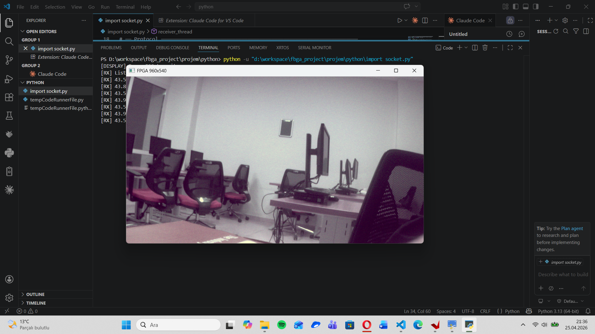

#  FPGA Tabanlı Çift Kamera Destekli Gerçek Zamanlı Görüntü Aktarım Sistemi

<div align="center">

[](https://gitlab.com/senadurarslan/muhtas2-220208041/-/pipelines)


**MÜHTAS-2 | Kocaeli Üniversitesi Mühendislik Fakültesi**  
Elektronik ve Haberleşme Mühendisliği — 2025-2026 Dönem Projesi  
**Öğrenci:** Sena Sümeyye DURARSLAN (220208041) | **Danışman:** Doç. Dr. Anıl ÇELEBİ

</div>

---
## Ders ve Proje Oynatma Listeleri

### FPGA ve Gömülü Sistemler Laboratuvarı
FPGA ve Gömülü Sistemler dersi laboratuvar çalışmaları için YouTube oynatma listesi:

[FPGA ve Gömülü Sistemler Lab Playlist](https://www.youtube.com/playlist?list=PLeLpqnbPLxx7-atBR0zlaCGycbTNQZUoE)

---

### MUHTAS Projesi
MUHTAS projesi kapsamında kullanılan çalışmalar ve içerikler için YouTube oynatma listesi:

[MUHTAS Projesi Playlist](https://www.youtube.com/playlist?list=PLeLpqnbPLxx6lbPfqskw-W4pXyyLIWIze)
##  Proje Özeti

Bu proje, **ZedBoard (Zynq-7000 SoC)** platformu üzerinde **iki adet OV5640 MIPI CSI-2 kamera** kullanarak gerçek zamanlı stereo görüntü yakalama, FPGA tabanlı donanım boru hattında işleme ve **Ethernet (UDP) üzerinden bilgisayara aktarım** sistemini gerçekleştirmektedir.

Sistem; MIPI D-PHY, AXI VDMA, lwIP ve OpenCV bileşenlerini bir araya getirerek **bare-metal donanım-yazılım birlikte tasarım (HW/SW Co-Design)** yaklaşımıyla geliştirilmiştir. Nihai hedef, iki kameradan elde edilen stereo görüntünün PC tarafında işlenerek derinlik haritası ve nesne tespiti uygulamalarına zemin hazırlamaktır.

---

##  Proje Amacı

- İki farklı kameradan **eş zamanlı** görüntü verisi almak (Port A ve Port B)
- Görüntüleri FPGA donanım boru hattında işleyip DDR3 belleğe tamponlamak
- Gigabit Ethernet üzerinden **UDP protokolüyle** bilgisayara aktarmak
- PC tarafında **OpenCV** ile görüntüleri yeniden oluşturmak ve görüntülemek
- Stereo kamera çiftinden **derinlik algısı ve nesne takibi** sağlamak

---

##  Sistem Mimarisi


### PL Boru Hattı Blokları

| Blok | Görevi |
|------|--------|
| MIPI D-PHY RX | Fiziksel katman veri alımı |
| MIPI CSI-2 RX | Çerçeve ayrıştırma |
| AXI Bayer-to-RGB | Ham sensör verisini RGB'ye dönüştürme |
| AXI Gamma Correction | Parlaklık düzeltmesi |
| HLS Video Scaler | Çözünürlük ölçekleme (960×540) |
| AXI VDMA | DMA ile DDR3'e çerçeve yazımı |
| AXI Interconnect | AXI bus yönetimi |

---

##  Sistem Görselleri


### PC Tarafı — OpenCV ile Görüntü Gösterimi



*Python socket → NumPy → OpenCV pipeline ile gerçek zamanlıya yakın görüntüleme*

---

### Çalışan Sistem — Dual Kamera Canlı Akışı

> İki kameranın eş zamanlı çalışması: Port A ve Port B görüntüleri Vitis IDE üzerinden izleniyor.


*Port A (960×540) ve Port B (960×540) — ~30 FPS canlı UDP akışı*

---


### FPGA Geliştirme Ortamı — Vivado Blok Tasarımı


---


##  Stereo Vision Nedir?

İki kamera aynı sahneye farklı açılardan bakarak insan gözünün derinlik algısını taklit eder. Bu proje bağlamında stereo vision sistemi şu işlemleri hedeflemektedir:

```
Sol Kamera (Port A)    Sağ Kamera (Port B)
       │                      │
       └──────┬───────────────┘
              ▼
     Lens Distorsiyon Düzeltme (Undistortion)
              │
              ▼
     Stereo Rektifikasyon (Epipolar Hizalama)
              │
              ▼
     Disparity Haritası (SGM / BM algoritması)
              │
              ▼
     Derinlik Haritası (Depth Map)
              │
              ▼
     Nesne Tespiti & Mesafe Hesaplama
```

**Temel avantajları:**
- Tek kameraya göre **3 boyutlu algılama**
- Pasif sistemde **LiDAR gerektirmeden** derinlik tahmini
- OpenCV'nin hazır stereo algoritmaları ile hızlı entegrasyon (`cv2.StereoSGBM`, `cv2.StereoBM`)

---

##  Neden Bu Mimari?

| Karar | Gerekçe |
|-------|---------|
| **ZedBoard / Zynq-7020** | PS+PL tek yongada; görüntü işleme için donanım paralelliği + ARM esnekliği |
| **Bare-metal** | Linux'a göre düşük gecikme, doğrudan donanım erişimi, deterministik zamanlama |
| **MIPI CSI-2** | Modern kamera sensörlerinde standart, yüksek bant genişlikli arayüz |
| **AXI VDMA** | Yüksek hızlı DMA ile DDR3 frame buffering; CPU yükü minimize |
| **Gigabit Ethernet** | USB/UART'a göre yüksek bant genişliği, ağ tabanlı veri işleme uyumu |
| **UDP** | TCP'ye göre düşük protokol yükü; gerçek zamanlı akışta gecikme önceliği |
| **Python + OpenCV** | Hızlı prototipleme, hazır stereo algoritmaları, NumPy ile verimli frame işleme |

---

##  Tamamlanan Aşamalar

###  Altyapı ve Ortam
- [x] FPGA geliştirme ortamının kurulumu (Vivado + Vitis)
- [x] LED / buton / switch temel donanım testleri
- [x] UART üzerinden başarılı test mesajları

###  Ağ Altyapısı
- [x] Statik IP yapılandırması (Board: `192.168.1.50`, PC: `192.168.1.100`)
- [x] Temel Ethernet haberleşmesinin doğrulanması
- [x] lwIP ile UDP socket kurulumu
- [x] Python socket üzerinden veri alma testleri

###  Kamera ve Görüntü Sistemi
- [x] OV5640 kamera başlatma (I²C üzerinden)
- [x] MIPI CSI-2 → AXI boru hattının yapılandırılması
- [x] VDMA ile DDR3 frame buffering
- [x] Port A kamera verisinin DDR'den okunması
- [x] Port B kamera verisinin DDR'den okunması

###  Veri Aktarımı
- [x] Ham frame verisinin UDP paketlere bölünmesi (fragmentation)
- [x] 1111 paket / 1.555.200 byte tam frame transferi
- [x] Python tarafında frame yeniden oluşturma (reassembly)
- [x] OpenCV ile görüntünün ekranda gösterilmesi
- [x] **Çift kamera (Port A + Port B) eş zamanlı canlı akışı — ~30 FPS**

---

##  Devam Eden / Planlanan Aşamalar

### Kısa Vadeli
- [ ] Stereo kalibrasyon (kamera iç ve dış parametreleri)
- [ ] Lens distorsiyon düzeltmesi (undistortion)
- [ ] Stereo rektifikasyon (epipolar geometry)

### Orta Vadeli
- [ ] Disparity haritası hesaplama (`cv2.StereoSGBM` veya `cv2.StereoBM`)
- [ ] Derinlik haritası oluşturma
- [ ] Nesne tespiti ve mesafe hesaplama

### Uzun Vadeli
- [ ] Panoramik görüntü birleştirme (stitching) altyapısı
- [ ] Gimbal entegrasyonu için kamera yön kontrolü

---

##  Ağ Yapılandırması

| Parametre | Değer |
|-----------|-------|
| Board IP | `192.168.1.50` |
| PC IP | `192.168.1.100` |
| Netmask | `255.255.255.0` |
| Gateway | `192.168.1.1` |
| Yerel Port | `5005` |
| Uzak Port | `7000` |
| Protokol | UDP |
| Frame Boyutu | 960 × 540 × 3 = 1.555.200 byte |

---

##  Kullanılan Donanım ve Yazılım

### Donanım
| Bileşen | Detay |
|---------|-------|
| FPGA Kartı | Avnet ZedBoard (Zynq-7020) |
| Kamera Arayüz Kartı | Digilent FMC PCam Adapter |
| Kamera Modülleri | 2× Digilent Pcam 5C (OV5640, MIPI CSI-2) |
| Bağlantı | Gigabit Ethernet (RJ45) |
| Bellek | 512 MB DDR3 |

### Yazılım ve Araçlar
| Araç | Kullanım Alanı |
|------|----------------|
| Vivado | FPGA tasarımı ve blok diyagram |
| Vitis IDE | Bare-metal yazılım geliştirme |
| C / C++ | PS tarafı sistem yazılımı |
| lwIP | Hafif ağ yığını (UDP/TCP) |
| Python 3 | PC tarafı veri alma ve görüntüleme |
| OpenCV | Görüntü işleme ve stereo algoritmaları |
| NumPy | Frame verisi manipülasyonu |

---

## 📁 Klasör Yapısı

```bash
.
├── Vitis_project/                       # Vitis workspace
│   ├── FMC_Pcam_Adapter_demo/           # Ana uygulama projesi (main.cc, network.c ...)
│   ├── FMC_Pcam_Adapter_demo_system/    # Sistem platform projesi
│   ├── Vitis/                           # Vitis IDE dosyaları
│   ├── eth_app/                         # Ethernet test uygulaması
│   ├── eth_app_system/                  # Ethernet sistem projesi
│   ├── python/                          # PC tarafı scriptler (import_socket.py)
│   ├── system_wrapper/                  # Hardware platform wrapper
│   ├── .analytics
│   └── .gitignore
├── vivado/                              # FPGA blok tasarımı ve bitstream
├── belgeler/                            # Raporlar, SRS, ara rapor
├── deneme/                              # Test ve deney kodları
├── görseller/                           # README görselleri
│   ├── sistem_mimari.png
│   ├── blok_diagram.png
│   ├── portA.png
│   ├── portA-B.png
│   └── vivado.png
├── mock_includes/                       # Test header dosyaları 
├── secmeli_lab/                         # Seçmeli lab çalışmaları
├── hardware_test.py                     # Donanım test scripti
├── udp_listen.py                        # UDP dinleme test scripti
├── toolchain-arm-none-eab...            # Cross-compiler toolchain config
├── .gitlab-ci.yml                       # CI/CD pipeline
├── CMakeLists.txt                       # CMake build
└── README.md
```

---

## 📖 Temel Kaynak Dosyalar

| Dosya | Açıklama |
|-------|----------|
| `main.cc` | PS ana döngüsü: kamera init, VDMA yönetimi, frame gönderimi |
| `network.c / .h` | lwIP UDP socket, fragmentation, gönderme mantığı |
| `OV5640.h` | OV5640 sensör register yapılandırması |
| `AXI_VDMA.h` | VDMA sürücü arayüzü |
| `PS_IIC.h` | I²C sürücüsü (kamera init için) |
| `import_socket.py` | PC tarafı UDP alıcı ve OpenCV görüntüleyici |

---

##  Performans Özeti

| Metrik | Değer |
|--------|-------|
| Çözünürlük (her kamera) | 960 × 540 @ RGB |
| Paket sayısı / frame | ~1111 UDP paketi |
| Alınan FPS (PC) | ~30 FPS |
| Veri hızı | ~0.3 MB/s (gözlemlenen) |
| Gecikme tipi | Düşük (UDP, bare-metal) |

---

## 🔗 İlgili Belgeler

- 📄 [Sistem Gereksinimleri Raporu (SRS)](belgeler/)
- 📄 [Ara Rapor](belgeler/)
- 📐 [ZedBoard Hardware User Guide](belgeler/)

---

<div align="center">

**Kocaeli Üniversitesi — Elektronik ve Haberleşme Mühendisliği**  
MÜHTAS-2 | 2025-2026  
Sena Sümeyye DURARSLAN · Doç. Dr. Anıl ÇELEBİ

</div>